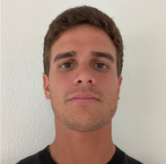

<h2>Franco Harte Portfolio</h2>

My name is Franco Harte, I'm 25 and I finished my studys of data science at Nucleo Digital School this year.

So far, I finished my bachelor degree of mechanical engineering in the University of Rosario (Argentina) in 2021, come abroad that same year to Belgium to play professional Field Hockey (what I still do) and at the same time I studied data science. Thanks to my previous degree I've been able to acquire knowledge in general science, statistics and design working with programmes such as Matlab and SolidWorks studio, what have been very useful and advantageous for my Data Science development.

In this Github profile it will be posted different projects of Data science where my skills as a Data Scientist will be shown.

<h2><u>Projects</u></h2>

[Project 1: BMW agency's Price Predictor 🚗💲✔](https://github.com/fh17/Franco_portfolio/blob/main/Portfolio/Proyect_Prediction_BMW%20.ipynb)

Showcase of data engineering techniques and predictions.
Exploratory data analysis.
Data Cleaning and Preprossesing.
Prediction method application:
    Linear Regression, 
    Support Vector Regression, 
    K Neighbors Regressor, 
    Decision Tree, 
    Gradient Boosting Regressor.
Evaluation of the models through different metrics and plots.

[Project 2: Malware detection 👾 💻](https://github.com/fh17/Franco_portfolio/blob/main/Portfolio/0322_SupML_Franco_Harte.ipynb)

This project is a Kaggle competition of Microsoft of 2016 where the goal was to make a model which predicts if a computurer was going to be infected.
Concepts that were emphasized inthis work were:
    Data cleaninig,
    Optimisation of the code,
    Metrics for evaluation

[Project 3: TimeSerie Benchmark 📈](https://github.com/fh17/Franco_portfolio/blob/main/Portfolio/benchmark-ts-n-xgboost-kaggle.ipynb)

In this project I had to use the XGBoost algorithm to work with Time Series and the focus was on the "Benchmark " mode. To get a quick first resolt as the minimum score possible for the prediction 

[Proyect 4: Image Clasificator 🎴🗺🖼](https://github.com/fh17/Franco_portfolio/blob/main/Portfolio/DeepLearningProyect_ImagesClasificator.ipynb)

In the following project two approches were used, working with the dataset cifrar100 from Pytorch library. In the frist approch, the strategy was to use a pre-trained neuronal network called ResNet50 where classified the photos were classified into 100 different classes. In the second one, the strategy was to test different arquitectures looking for the highest accuracy.

[Project 5: Cliff Walking Problem ⚙🛠](https://github.com/fh17/Franco_portfolio/blob/main/Portfolio/Cliff_Walking.ipynb)

The Walking Cliff project is a reinforcement learning problem from "gym library" where an agent, represented by a simple stick figure, must learn to navigate a cliff-like environment without falling. The agent receives rewards for reaching the end of the cliff and penalties for falling off. The project is designed to showcase the capabilities of reinforcement learning algorithms, which enable agents to learn from trial and error using a system of rewards and punishments.

[Project 6: Final Proyect of the Master "DSMarket Data Science Implementation" 🥇 ](https://github.com/fh17/Franco_portfolio/blob/main/Portfolio/TFM_code.ipynb )

This is the Final Evaluation of the Nuclio Digital School Data Science´s Master. In which the student (myself) had to develop de hole deparment of  data science for the company SDMarket, Starting from analising and exploring all the sales data that the company was saving the last years, understandig the buisness, propousing ideas to improve the working sistem of the company, such as stock management, shipment work and publisity aplication. And also the debelopment of a maching lerning tool that can make all of this easier to do, and its subsequent implementation
